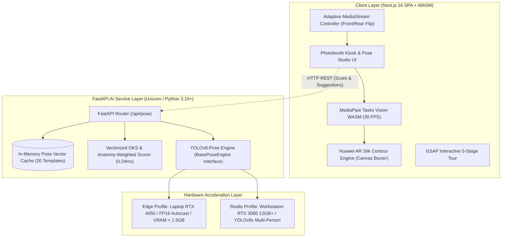

<div align="center">

# 📸 Pose-Booth AI
### Next-Gen Photobooth Kiosk với Đường Viền Lụa Huawei AR & Động Cơ Trí Tuệ Nhân Tạo Dual-Profile

[](https://nextjs.org)
[](https://fastapi.tiangolo.com)
[](https://pytorch.org)
[](https://ultralytics.com)
[](https://developers.google.com/mediapipe)
[](https://tailwindcss.com)
[](https://greensock.com)
[](LICENSE)

<p align="center">
  <b>Hệ thống phòng chụp ảnh Photobooth thông minh tích hợp thị giác máy tính: loại bỏ hoàn toàn khung xương stickman que diêm thô kệch, thay thế bằng đường viền lụa AR bán trong suốt lấy cảm hứng từ camera flagship Huawei & PikPose. Tối ưu hóa toàn diện cho phần cứng laptop RTX 4050 di động và máy trạm studio RTX 3060.</b>
</p>

[✨ Tính Năng Nổi Bật](#-tính-năng-nổi-bật) •
[🏗️ Kiến Trúc Hệ Thống](#️-kiến-trúc-hệ-thống) •
[⚙️ Cấu Hình Phần Cứng Dual-Profile](#️-cấu-hình-phần-cứng-dual-profile) •
[🚀 Cài Đặt & Khởi Chạy Nhanh](#-cài-đặt--khởi-chạy-nhanh) •
[📡 API Contracts](#-api-contracts) •
[🌐 Triển Khai Production](#-triển-khai-production) •
[❓ Xử Lý Lỗi Thường Gặp](#-xử-lý-lỗi-thường-gặp)

---

</div>

## ✨ Tính Năng Nổi Bật

| Phân hệ | Tính năng kỹ thuật | Giá trị trải nghiệm người dùng |
| :--- | :--- | :--- |
| **Huawei AR Silk Silhouette** | Thuật toán trích xuất đường bao Bezier cong mềm mại ôm trọn cơ thể, phát quang vàng **Champagne Gold (`#FCD34D`)** hoặc **Cyan** khi khớp tư thế $\ge 85\%$. | Xóa bỏ cảm giác vướng víu của que xương stickman. Người dùng nhìn rõ khuôn mặt, ánh mắt và trang phục khi đứng trước ống kính. |
| **Dual-Profile AI Engine** | Kiến trúc 2 cấu hình tự động thích ứng phần cứng: **Edge Profile** (FP16 Autocast, VRAM < 1.5GB, suy luận < 8ms) và **Studio Profile** (YOLOv8x đa người). | Chạy mượt mà trên laptop di động (i5 13500HX + RTX 4050 6GB) lẫn máy trạm phòng chụp (R7 5700X + RTX 3060 12GB). |
| **Vectorized OKS Scoring** | Tính toán Object Keypoint Similarity chuẩn hóa COCO 17 khớp và ma trận giải phẫu học Anatomy-Weighted Cosine bằng NumPy C-level. | Độ trễ chấm điểm chỉ **0.24ms**, thông lượng đạt **4,141 lượt so khớp/giây**, phản hồi tức thì dưới 1 khung hình. |
| **Interactive 5-Stage Tour** | Khung điện thoại Titanium 3D morphing mượt mà qua 5 giai đoạn: *Lookbook $\rightarrow$ Quét Viền AR $\rightarrow$ Micro-Radar HUD $\rightarrow$ Khóa Shutter $\rightarrow$ Dải Film Life4Cuts*. | Không cướp quyền cuộn chuột (zero scroll hijacking), không giật khựng, tương thích 100% chuột, touchpad và cảm ứng. |
| **Native Photobooth Kiosk** | Khung ngắm chuẩn 3:4 chân dung, bộ lọc thích ứng camera đa thiết bị (Laptop, webcam USB, iPhone Safari, Android Chrome). | Hỗ trợ nút lật camera Trước/Sau một chạm, dải carousel chọn dáng mẫu ở đáy, nút chụp xúc giác tròn có đèn LED trạng thái. |
| **In Ấn & Xuất Dải Film** | Hỗ trợ chụp 1 ảnh đơn, dải film strip 3 ảnh dọc, hoặc khung lưới collage 4 ảnh Life4Cuts với 4 màu viền thời thượng. | Xuất file ảnh độ phân giải cao tức thì, hỗ trợ in ấn trực tiếp hoặc quét mã QR tải về điện thoại. |

---

## 🏗️ Kiến Trúc Hệ Thống



---

## ⚙️ Cấu Hình Phần Cứng Dual-Profile

Dự án được thiết kế độc quyền với cơ chế **Dual-Profile** chuyển đổi linh hoạt qua biến môi trường `AI_PROFILE` trong file `.env`:

```ini
# Cấu hình Profile AI: 'edge' (Laptop RTX 4050) hoặc 'studio' (Workstation RTX 3060)
AI_PROFILE=edge
DEVICE=cuda
USE_FP16=true
CONF_THRESHOLD=0.45
```

### Bảng So Sánh Hai Cấu Hình

| Thông số kỹ thuật | Profile 1: Edge (Mì Ăn Liền / Laptop) | Profile 2: Studio (Máy Trạm Chuyên Nghiệp) |
| :--- | :--- | :--- |
| **Phần cứng mục tiêu** | Intel Core i5-13500HX, RTX 4050 6GB Laptop GPU | AMD Ryzen 7 5700X, RTX 3060 12GB / RTX 4070 |
| **Trọng số Model** | `yolov8n-pose.pt` hoặc `yolov8s-pose.pt` | `yolov8m-pose.pt` hoặc `yolov8x-pose.pt` |
| **Độ chính xác Tensor** | FP16 Half Precision (`model.half()`) | FP16 / FP32 Full Precision |
| **Chiếm dụng VRAM** | $\le \mathbf{1.2 - 1.5\text{ GB}}$ (khởi động tức thì) | $\approx 3.5 - 5.5\text{ GB}$ |
| **Độ trễ suy luận AI** | $\mathbf{\approx 6 - 8\text{ ms}}$ / frame | $\approx 12 - 16\text{ ms}$ (độ chính xác cực cao) |
| **Khả năng theo dõi** | 1 - 2 người trong khung hình | 2 - 6 người (chụp nhóm bạn bè, gia đình) |
| **Warm-up khởi động** | Tensor giả lập 640x640 ngay khi nạp model | Đa luồng xử lý song song |

---

## 📂 Cấu Trúc Thư Mục Codebase

```
pose-booth-ai/
├── apps/
│   ├── web/                          # Next.js 16 SPA (TypeScript + Tailwind CSS 4)
│   │   ├── app/                      # App Router routes
│   │   │   ├── page.tsx              # Landing page (Bento grid + Interactive tour)
│   │   │   ├── booth/page.tsx        # Photobooth Kiosk (Adaptive camera, 3:4 ratio)
│   │   │   ├── pose-studio/page.tsx  # Studio tập luyện tư thế thời gian thực
│   │   │   └── about/page.tsx        # Trang giới thiệu kiến trúc & tài liệu
│   │   ├── components/
│   │   │   ├── pose/
│   │   │   │   └── HuaweiArContour.tsx # Lõi vẽ đường viền lụa Bezier & radar khớp
│   │   │   ├── hero/
│   │   │   │   └── PinnedScrollytellingShowcase.tsx # 5-Stage Interactive Product Tour
│   │   │   └── booth/
│   │   │       └── PhotoBoothController.tsx # State machine đếm ngược & chụp ảnh
│   │   ├── lib/
│   │   │   ├── mediapipe/usePoseDetection.ts # Hook nhận diện 33 điểm WASM GPU
│   │   │   └── useCamera.js          # Bộ điều khiển camera webcam & stream
│   │   └── public/
│   │       └── models/               # Model tĩnh MediaPipe lite zero-latency
│   │
│   └── api/                          # FastAPI Backend AI Dual-Profile
│       ├── main.py                   # Điểm khởi chạy API + Quản lý Lifespan
│       ├── config.py                 # Cấu hình Pydantic BaseSettings tự nhận CUDA/FP16
│       ├── benchmark.py              # Script đo đạc tốc độ OKS & thông lượng bộ nhớ
│       ├── core/
│       │   └── engine.py             # YOLOv8PoseEngine kế thừa BasePoseEngine
│       ├── services/
│       │   ├── scoring.py            # Vectorized OKS + Anatomy-Weighted Cosine Math
│       │   └── library.py            # PoseLibraryService cache 20 dáng vào RAM
│       ├── routers/
│       │   ├── score.py              # POST /api/pose/score (So khớp & phản hồi)
│       │   ├── pose.py               # POST /api/pose/analyze (Phân tích ảnh)
│       │   └── suggest.py            # GET /api/pose/suggest (Gợi ý dáng mẫu)
│       ├── data/pose_library/
│       │   └── poses.json            # 20 templates tư thế chuẩn quốc tế COCO 17
│       └── requirements.txt          # Danh sách thư viện Python
│
├── nginx/
│   └── pose-booth.conf               # File cấu hình Nginx SPA fallback & Reverse Proxy
├── docs/                             # Tài liệu gán nhãn dữ liệu & báo cáo an toàn
├── DEPLOY.md                         # Hướng dẫn chi tiết triển khai máy chủ Linux
└── README.md                         # Tài liệu hướng dẫn toàn diện dự án
```

---

## 🚀 Cài Đặt & Khởi Chạy Nhanh

### Yêu Cầu Môi Trường
* **Node.js**: $\ge 18.18$ hoặc $20+$ (đã kiểm thử trên Node 20 / 22)
* **Python**: $3.10+$ (khuyên dùng Python 3.11 hoặc 3.12)
* **Card đồ họa (tùy chọn)**: NVIDIA GTX 1650 trở lên có cài CUDA 11.8 hoặc 12.x (nếu không có GPU, hệ thống tự động fallback sang CPU mượt mà).

---

### Bước 1: Clone Kho Mã Nguồn

```bash
git clone https://github.com/xukki241/pose-booth-ai.git
cd pose-booth-ai
```

---

### Bước 2: Cài Đặt & Chạy Backend AI (FastAPI)

Mở terminal tại thư mục gốc của dự án:

```powershell
# Di chuyển vào thư mục API
cd apps/api

# Khởi tạo môi trường ảo Python
python -m venv .venv

# Kích hoạt môi trường ảo:
# Trên Windows PowerShell:
.\.venv\Scripts\Activate.ps1
# Trên Linux / macOS:
# source .venv/bin/activate

# Cài đặt toàn bộ thư viện cần thiết
pip install -r requirements.txt

# (Khuyên dùng) Chạy script benchmark để kiểm tra tốc độ chấm điểm trên máy bạn:
python benchmark.py

# Khởi chạy máy chủ FastAPI (Port 8000)
python -m uvicorn main:app --host 127.0.0.1 --port 8000 --reload
```
> 💡 Kiểm tra máy chủ backend hoạt động tại: [http://127.0.0.1:8000/health](http://127.0.0.1:8000/health) hoặc xem Swagger UI tại [http://127.0.0.1:8000/docs](http://127.0.0.1:8000/docs).

---

### Bước 3: Cài Đặt & Chạy Frontend (Next.js 16)

Mở một cửa sổ terminal mới:

```powershell
# Di chuyển vào thư mục Web
cd apps/web

# Cài đặt dependencies
npm install

# Khởi chạy chế độ phát triển
npm run dev
```

* Mở trình duyệt và truy cập: **[http://localhost:3000](http://localhost:3000)**
* Trải nghiệm Photobooth Kiosk tại: **[http://localhost:3000/booth](http://localhost:3000/booth)**
* Trải nghiệm Studio Tạo Dáng tại: **[http://localhost:3000/pose-studio](http://localhost:3000/pose-studio)**

---

## 📡 API Contracts

### 1. `GET /health`
Kiểm tra sức khỏe hệ thống, cấu hình phần cứng và trạng thái cache mô hình.
* **Response**:
```json
{
  "status": "ok",
  "profile": "edge",
  "device": "cuda",
  "fp16_enabled": true,
  "engine_ready": true,
  "library_poses_cached": 20
}
```

### 2. `POST /api/pose/score`
Chấm điểm độ khớp giữa tư thế người dùng hiện tại và tư thế mục tiêu theo chuẩn OKS.
* **Request Body**:
```json
{
  "user_keypoints": [
    {"x": 0.51, "y": 0.16, "confidence": 0.95},
    {"x": 0.49, "y": 0.14, "confidence": 0.92}
  ],
  "target_keypoints": [
    {"x": 0.50, "y": 0.15, "confidence": 1.0},
    {"x": 0.48, "y": 0.13, "confidence": 1.0}
  ]
}
```
* **Response**:
```json
{
  "score": 94,
  "oks_score": 0.941,
  "matched": true,
  "feedback": [
    "Dáng khớp rất chuẩn! Giữ yên tư thế để chụp."
  ],
  "joint_deviations": {
    "left_shoulder": 0.012,
    "right_shoulder": 0.015
  },
  "latency_ms": 0.24
}
```

### 3. `GET /api/pose/suggest`
Lấy danh sách các dáng mẫu từ bộ nhớ đệm RAM.
* **Query Params**: `category` (all, portrait, dynamic, fun), `limit` (mặc định 20)
* **Response**: Trả về mảng JSON 20 tư thế mẫu có chứa tọa độ chuẩn hóa $[x, y]$ của 17 khớp xương.

---

## 🌐 Triển Khai Production

Dự án đi kèm cấu hình Nginx tối ưu hóa cho ứng dụng Single Page Application (SPA) và Reverse Proxy API tại [`nginx/pose-booth.conf`](nginx/pose-booth.conf).

### Các bước triển khai trên Ubuntu/Debian Linux Server:

1. **Build tĩnh Frontend**:
   ```bash
   cd apps/web
   npm run build
   ```
2. **Cấu hình Systemd Daemon cho FastAPI**:
   Tạo file `/etc/systemd/system/pose-booth-api.service`:
   ```ini
   [Unit]
   Description=Pose Booth AI FastAPI Service
   After=network.target

   [Service]
   User=www-data
   WorkingDirectory=/var/www/pose-booth/apps/api
   Environment="PATH=/var/www/pose-booth/apps/api/.venv/bin"
   ExecStart=/var/www/pose-booth/apps/api/.venv/bin/uvicorn main:app --host 127.0.0.1 --port 8000 --workers 2
   Restart=always

   [Install]
   WantedBy=multi-user.target
   ```
3. **Kích hoạt Nginx Reverse Proxy**:
   ```bash
   sudo cp nginx/pose-booth.conf /etc/nginx/sites-available/pose-booth
   sudo ln -s /etc/nginx/sites-available/pose-booth /etc/nginx/sites-enabled/
   sudo nginx -t && sudo systemctl reload nginx
   ```

---

## ❓ Xử Lý Lỗi Thường Gặp (Troubleshooting)

### 1. Không mở được Camera trên trình duyệt điện thoại (iOS / Android)
* **Lý do**: Các trình duyệt hiện đại (Safari trên iOS, Chrome trên Android) bắt buộc kết nối phải là **HTTPS** hoặc **localhost** thì mới cho phép gọi API `navigator.mediaDevices.getUserMedia`.
* **Cách khắc phục**:
  - Nếu test qua mạng LAN nội bộ (ví dụ `http://192.168.1.15:3000`), hãy mở cờ trong Chrome điện thoại: `chrome://flags/#unsafely-treat-insecure-origin-as-secure`, nhập URL máy tính của bạn và chọn *Enabled*.
  - Hoặc dùng ngrok / Cloudflare Tunnel để cấp chứng chỉ HTTPS tạm thời: `ngrok http 3000`.

### 2. Camera đang bị ứng dụng khác chiếm dụng (NotReadableError)
* Hãy tắt các ứng dụng đang sử dụng webcam trên laptop như Zoom, Microsoft Teams, Skype hoặc ứng dụng Camera mặc định của Windows.

### 3. Máy không có GPU NVIDIA
* Backend AI tự động phát hiện nếu không có CUDA và chuyển sang `DEVICE=cpu` mà không gây gián đoạn hay crash ứng dụng. Tốc độ tính toán OKS trên CPU vẫn đạt dưới **1ms**.

---

## 📄 Bản Quyền & Giấy Phép

Dự án được phân phối dưới giấy phép **MIT License**. Xem chi tiết tại [LICENSE](LICENSE).  
Được phát triển và hoàn thiện cho đồ án công nghệ **FPT University — EXE101 Capstone Project**.
